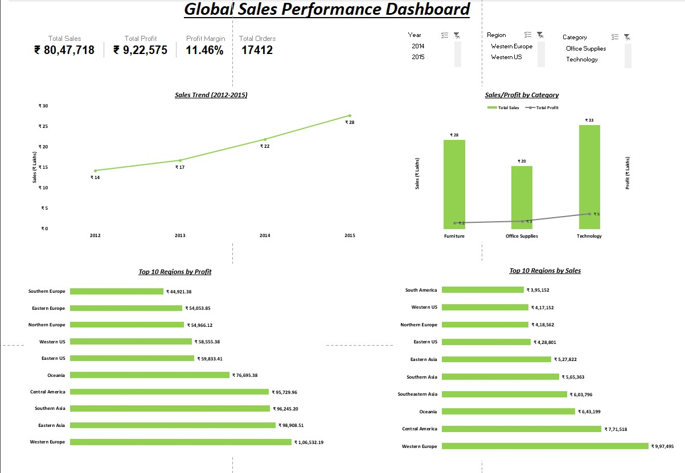

 # Global Sales Performance Dashboard
## Dashboard Preview

## Project Overview
This project analyzes global sales data using Microsoft Excel to evaluate
sales performance, profitability, and customer behavior across regions,
categories, and time periods.

The objective was to move beyond descriptive reporting and identify
actionable business insights using quantitative analysis.

## Dataset
- 17,000+ transaction records
- Multiple regions, categories, and years (2012–2015)

## Tools and Skills Used
- Microsoft Excel
- Power Query for data cleaning
- Pivot Tables and Pivot Charts
- KPI design and dashboard layout
- Slicers for interactive filtering

## Key Metrics
- Total Sales
- Total Profit
- Profit Margin
- Total Orders

## Key Business Insights
- Technology category delivers approximately 2 times higher profit margin than Furniture despite similar sales volumes.
- Western Europe contributes around 25% of total sales and profit, with the top three regions generating over 50% of total profit, indicating regional concentration risk.
- Sales increased consistently from 2012 to 2015, while profit growth lagged behind revenue growth, highlighting margin pressure.

## Business Value
This dashboard enables stakeholders to:
- Identify high-margin product categories
- Detect geographic concentration risks
- Compare sales growth against profitability
- Support margin-focused strategic decisions
